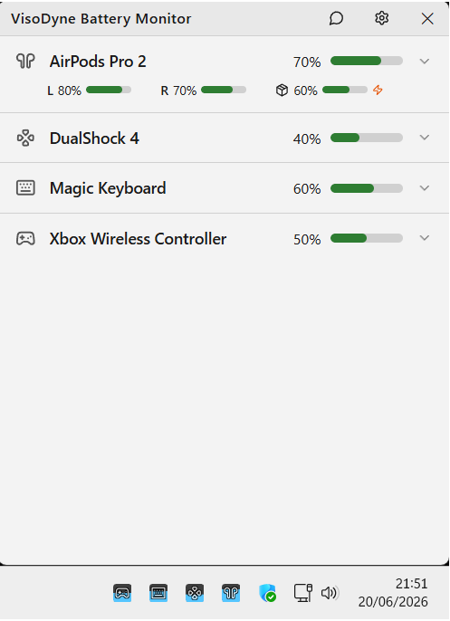
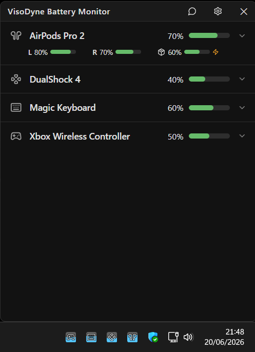
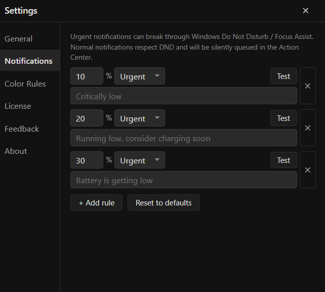
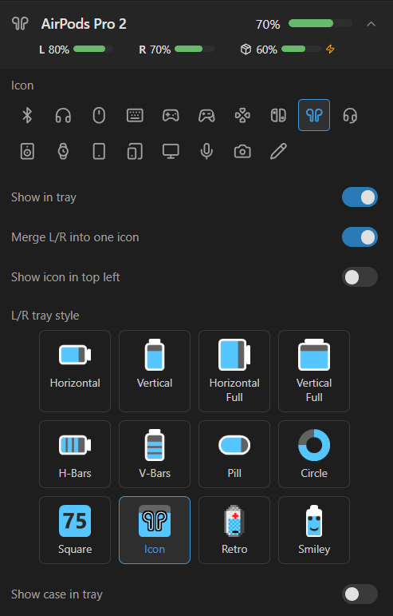
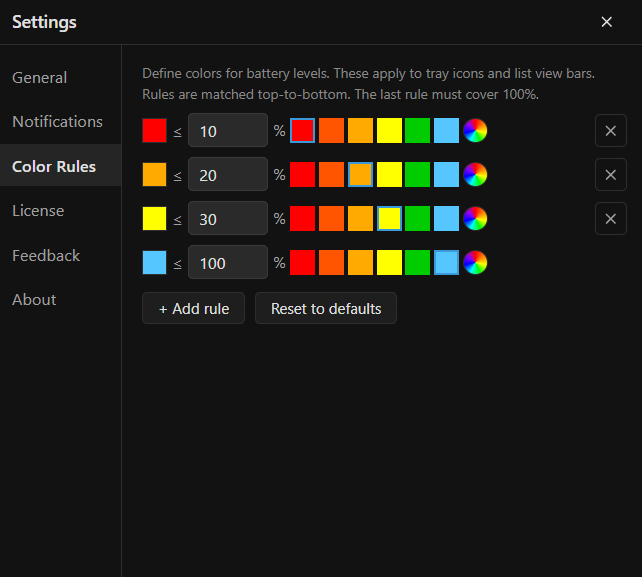
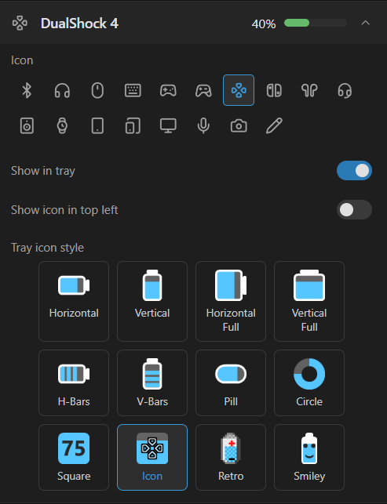
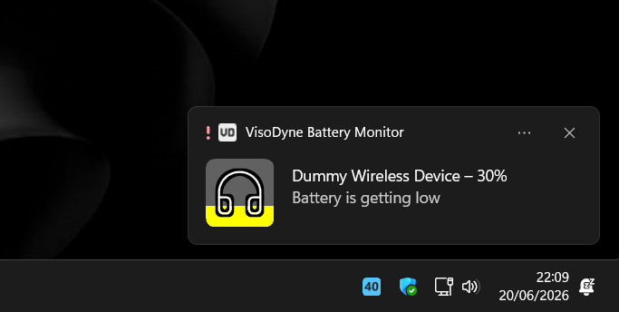

# VisoDyne Battery Monitor

  
  

VisoDyne Battery Monitor is a Windows 10/11 system-tray app for monitoring battery levels from wireless devices. It gives supported devices live battery percentages, configurable tray icons, low-battery notifications, and estimated remaining battery time.

## Download

[Download for Windows](https://download.visodyne.com/v1/batterymonitor/setup)

## Features

- Live per-device battery percentages in Windows system tray
- Individual left, right, and case battery levels for AirPods and compatible earbuds
- Configurable icon styles, device visibility, and battery-color thresholds
- Custom normal and urgent low-battery notifications
- Battery-time estimates for devices that report charge in coarse steps
- Background operation and optional Windows startup
- Built-in update checks with SHA-256 verification before applying downloaded updates

## Supported Devices

Compatibility depends on device firmware and how it reports battery information to Windows. The monitor supports a broad range of Bluetooth, 2.4 GHz, and proprietary wireless devices, including:

- Headphones, earbuds, AirPods, and compatible alternatives
- Wireless mice and keyboards
- DualShock, Xbox Wireless, and compatible game controllers
- Wireless speakers

Use the free trial to confirm detection for a specific device.

## Install

### Installer

1. Download setup using link above.
2. Run installer with administrator approval.
3. Launch **VisoDyne Battery Monitor** from Start menu or desktop shortcut.

## Screenshots

| Device overview | Notifications |
| --- | --- |
|  |  |

| AirPods detail | Color rules |
| --- | --- |
|  |  |

| Device settings | Battery warning |
| --- | --- |
|  |  |

## Updates

The app checks its stable update manifest in background. When a newer release is available, it downloads package, verifies its SHA-256 checksum, stages it on installation volume, then applies it once app is tray-only. Interrupted updates retain rollback data.

## Product Page

More details, free trial, and licensing: [visodyne.com/battery-monitor](https://visodyne.com/battery-monitor)